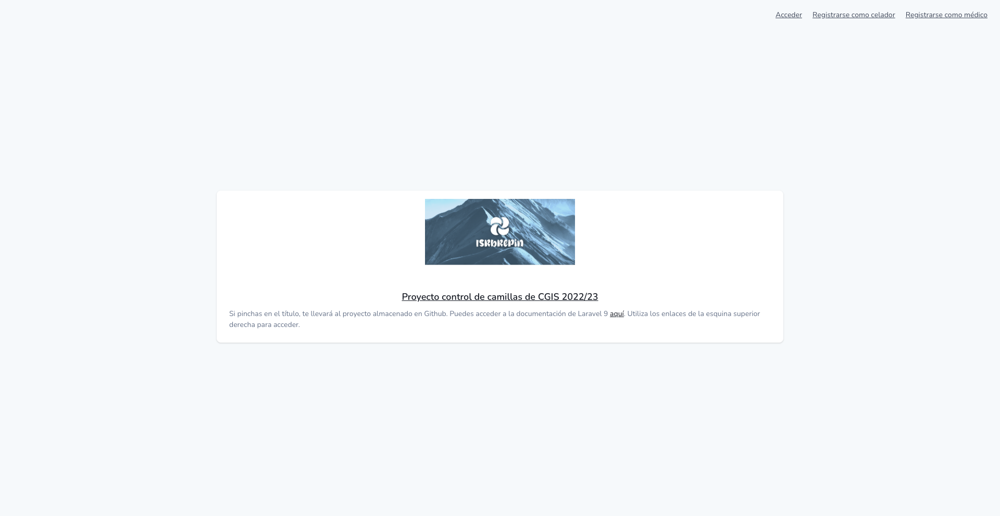
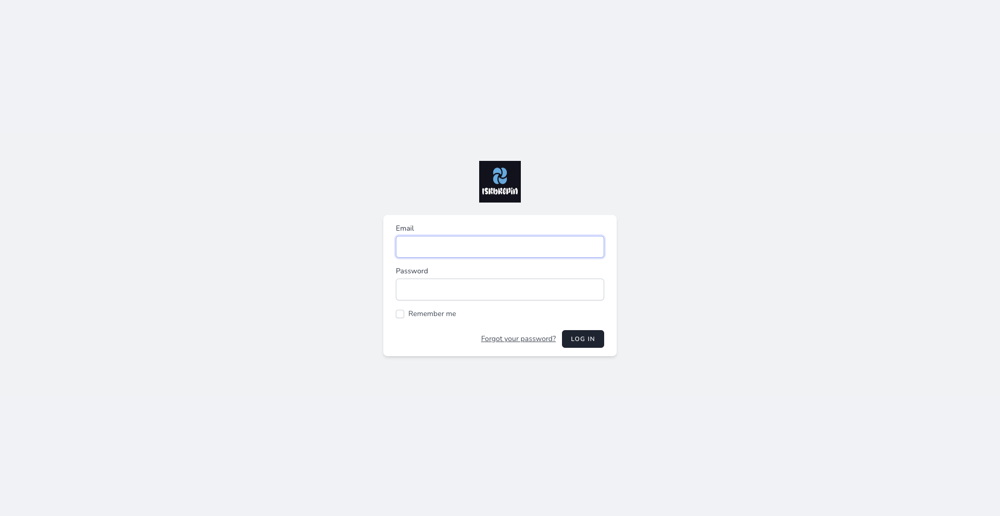
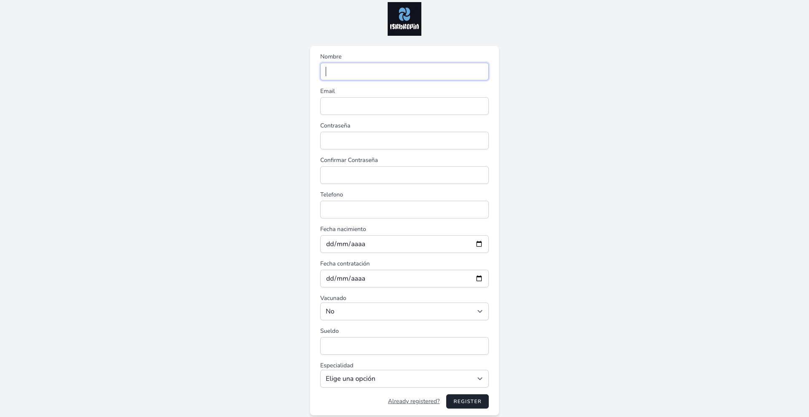
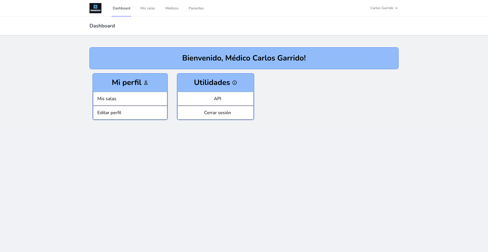
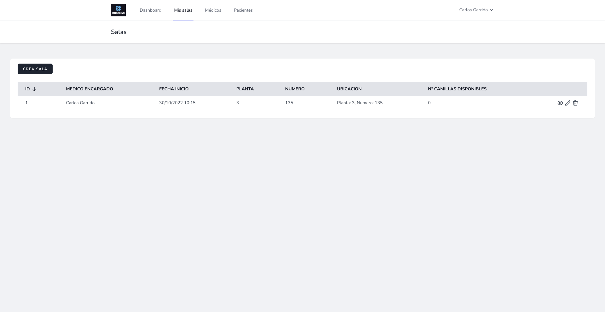
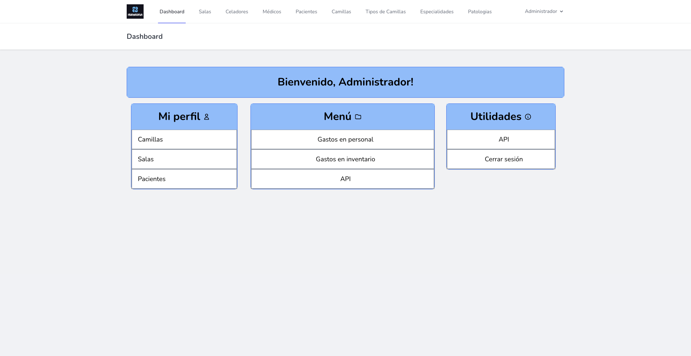
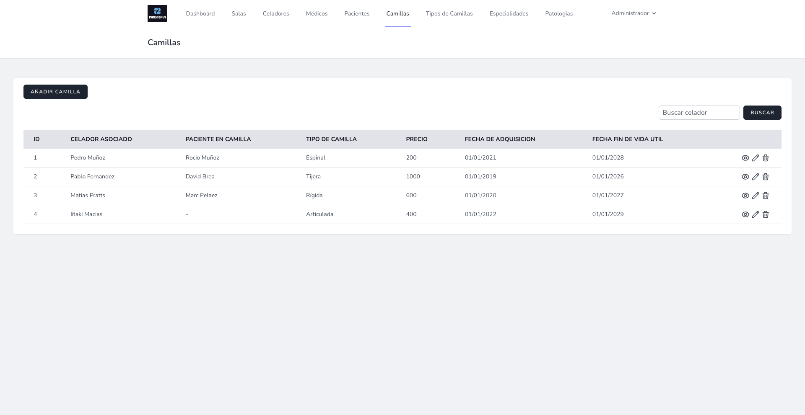
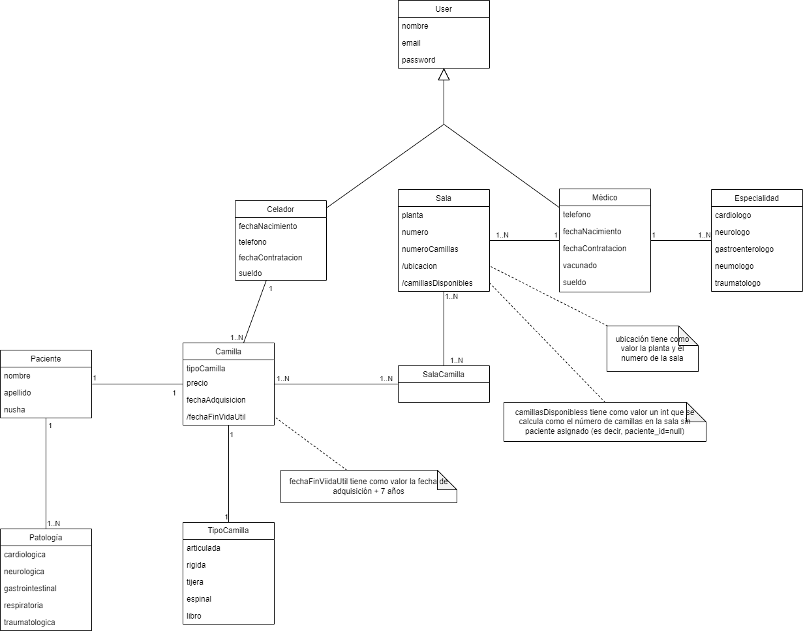

Este proyecto fue desarrollado para la asignatura de Codificación y gestión de información sanitaria (CGIS) durante mi tercer año de carrera. El objetivo principal es diseñar, modelar y desarrollar una aplicación web para la gestión de las camillas hospitalarias de una entidad sanitaria. 

    
    
    
    
    
    
    

## Indice

1. [Dominio del problema](#dominio-del-problema)
2. [Objetivos](#objetivos)
3. [Usuarios del sistema](#usuarios-del-sistema)
4. [Catálogo de requisitos](#catálogo-de-requisitos)
   - 4.1 [Requisitos de información](#requisitos-de-información)
   - 4.2 [Requisitos funcionales](#requisitos-funcionales)
   - 4.3 [Requisitos no funcionales](#requisitos-no-funcionales)
   - 4.4 [Reglas de negocio](#reglas-de-negocio)
5. [Modelo conceptual UML](#modelo-conceptual-uml)

## Dominio del problema

La gestión de camas en un centro hospitalario constituye una de las tareas cotidianas de cualquier servicio de admisión y también una de la que más conflictos provocan en el funcionamiento diario del hospital. La asignación de la cama al paciente que va a ingresar constituye sólo una parte de lo que se denomina Gestión de camas, y afecta tanto a los pacientes que van a ingresar como a los ya ingresados, y a las camas libres tanto como a las ocupadas.

## Objetivos

La exigencia de un adecuado control en la ocupación de camillas hospitalarias hace que se requiera una adecuada gestión de la información, un conocimiento sobre las diferentes salas de camillas, tipos de camillas, ocupación de las mismas, médicos encargados de cada paciente que tendrá una sala asignada, etc.… Dada esta situación, se plantea crear, una aplicación web donde cada usuario tendrá su propio acceso.

## Usuarios del sistema
Los tres usuarios que van a poder acceder al sistema van a ser: 
- Administrador 
-  Celador, solo podrá visualizar los datos que le corresponda. 
-  Médico, solo podrá visualizar los datos que le corresponda.
## Catálogo de requisitos
### Requisitos de información
**RI-001. Médicos.** El sistema deberá de almacenar información sobre los médicos. Nombre y apellido, password, especialidad, fecha de nacimiento, si está vacunado de COVID o no, teléfono, sueldo, y fecha de contratación.

Cada médico se encargará de (1..N) salas. Un médico se encarga de N pacientes. Un medico tiene (1..N) especialidades.

**RI-002. Celadores.** El sistema deberá de almacenar información sobre los celadores. Nombre y apellido, password, fecha de nacimiento, teléfono, fecha de contratación y sueldo.

Cada celador se encargará de (1..N) salas. Un celador se encarga de N pacientes.

**RI-003. Pacientes.** El sistema deberá de almacenar información sobre los pacientes. Nombre, apellido, nuhsa y patologías.

Cada paciente tiene (1..N) patologías. 1 paciente está asociado a 1 camilla.

**RI-004. Salas.** El sistema deberá de almacenar información sobre las salas. La planta en la que está situada la sala, el número de la sala, número de camillas disponibles en la sala, así como el médico asignado a la sala. 

N salas tiene asociadas N camillas.

**RI-005. Camillas.** El sistema deberá de almacenar información sobre las camillas. Tipo de camilla, celador responsable de la camilla, paciente asociado a la camilla, el precio, la fecha de adquisición y la fecha de fin de vida útil. 

N camillas pertenecen a 1 empresa.

**RI-006. Especialidad.** El sistema deberá de almacenar información sobre las especialidades de los médicos. Estas pueden ser: cardiólogo, neurólogo, gastroenterólogo, neumólogo y traumatólogo.

**RI-007. Patología.** El sistema deberá de almacenar información sobre las patologías de los pacientes. Estas pueden ser: cardiológica, neurológica, gastrointestinal, respiratoria y traumatológica.

### Requisitos funcionales

**RF-001. Listado de médicos.** Como administrador, quiero ver un listado de los médicos del sistema paginados de 10 en 10.

**RF-002. Detalle de médico.** Como administrador,** quiero ver el detalle de un médico.

**RF-003. Creación de médico.** Como administrador,** quiero crear un médico. Para ello, se debe indicar el nombre y apellido, especialidad, fecha de nacimiento, email, teléfono, DNI, si está vacunado o no de COVID, sueldo, y fecha de contratación. Deberé poder elegir la especialidad del médico entre el listado de especialidades ya existentes en la base de datos del sistema. El sistema debe impedir la creación de médico si:

- El email ya existe.

- El email no tiene el formato correcto.

- La contraseña no tiene al menos 8 caracteres y viene la contraseña y su confirmación.

- El sueldo no puede ser negativo

- La especialidad tiene que ser una de las ya disponibles en el sistema.

El sistema además deberá mostrar un mensaje de error en cada uno de los casos anteriores y, en caso de éxito, navegar al listado actualizado de médicos con un mensaje de éxito.

**RF-004. Edición de médico.** Como administrador,** quiero editar un médico eligiéndolo a partir del listado de médicos y llevándome a una nueva pantalla donde pueda trabajar con los datos. Para ello, se debe poder modificar el nombre y apellido, email, fecha de contratación, si está vacunado de COVID o no, el sueldo y la especialidad. Deberé poder elegir la especialidad del médico entre el listado de especialidades ya existentes en la base de datos del sistema. El sistema debe impedir la edición de médico si:

- El email no tiene el formato correcto.

- La contraseña no tiene al menos 8 caracteres y viene la contraseña y su confirmación.

- El sueldo no puede ser negativo

- La especialidad tiene que ser una de las ya disponibles en el sistema.

El sistema además deberá mostrar un mensaje de error en cada uno de los casos anteriores y, en caso de éxito, navegar al listado actualizado de médicos con un mensaje de éxito.

**RF-005. Borrado de médico.** Como administrador, quiero borrar un médico. El sistema deberá alertarme de la irrevocabilidad de esta acción y pedir confirmación. En caso de confirmación, el sistema deberá borrar el médico y navegar al listado actualizado de médicos con un mensaje de éxito.

**RF-006. Listado de médicos.** Como médico, quiero ver un listado de los médicos del sistema.

**RF-007. Detalle de médico.** Como médico,** quiero ver el detalle de un médico.

**RF-008. Listado de celadores.** Como administrador, quiero ver un listado de los celadores del sistema paginados de 10 en 10.

**RF-009. Detalle de celador.** Como administrador,** quiero ver el detalle de un celador.

**RF-010. Creación de celador.** Como administrador,** quiero crear un celador. Para ello, se debe indicar el nombre y apellido, fecha de nacimiento, teléfono, email, fecha de contratación y sueldo. El sistema debe impedir la creación de celador si:

- El email ya existe.

- El email no tiene el formato correcto.

- La contraseña no tiene al menos 8 caracteres y viene la contraseña y su confirmación.

- El sueldo no puede ser negativo

El sistema además deberá mostrar un mensaje de error en cada uno de los casos anteriores y, en caso de éxito, navegar al listado actualizado de celadores con un mensaje de éxito.

**RF-011. Edición de celador.** Como administrador,** quiero editar un celador eligiéndolo a partir del listado de celadores y llevándome a una nueva pantalla donde pueda trabajar con los datos. Para ello, se debe poder modificar el nombre y apellido, fecha de nacimiento, teléfono, email, DNI, fecha de contratación y sueldo. El sistema debe impedir la edición de médico si:

- El email no tiene el formato correcto.

- La contraseña no tiene al menos 8 caracteres y viene la contraseña y su confirmación.

- El sueldo no puede ser negativo

El sistema además deberá mostrar un mensaje de error en cada uno de los casos anteriores y, en caso de éxito, navegar al listado actualizado de médicos con un mensaje de éxito.

**RF-012. Borrado de celador.** Como administrador, quiero borrar un celador. El sistema deberá alertarme de la irrevocabilidad de esta acción y pedir confirmación. En caso de confirmación, el sistema deberá borrar el celador y navegar al listado actualizado de celadores con un mensaje de éxito.

**RF-013. Listado de celadores.** Como celador, quiero ver un listado de todos los celadores del sistema.

**RF-014. Detalle de celador.** Como celador,** quiero ver el detalle de un celador.

**RF-015. Listado de pacientes.** Como administrador, quiero ver un listado de los pacientes del sistema paginados de 10 en 10.

**RF-016. Detalle de paciente.** Como administrador,** quiero ver el detalle de un paciente.

**RF-017. Creación de paciente.** Como administrador,** quiero crear un paciente. Para ello, se debe indicar el nombre, apellido, el número de Nusha y patologías. Deberé poder elegir la patología del paciente entre el listado de patologías ya existentes en la base de datos del sistema. El sistema debe impedir la creación de paciente si:

- La patología tiene que ser una de las ya disponibles en el sistema.

El sistema además deberá mostrar un mensaje de error en cada uno de los casos anteriores y, en caso de éxito, navegar al listado actualizado de pacientes con un mensaje de éxito.

**RF-018. Edición de paciente.** Como administrador,** quiero editar un paciente eligiéndolo a partir del listado de pacientes y llevándome a una nueva pantalla donde pueda trabajar con los datos. Para ello, se debe poder modificar el nombre y apellido, número de Nuhsa y patologías. Deberé poder elegir la patología del paciente entre el listado de patologías ya existentes en la base de datos del sistema. El sistema debe impedir la edición de paciente si:

- La patología tiene que ser una de las ya disponibles en el sistema.

El sistema además deberá mostrar un mensaje de error en cada uno de los casos anteriores y, en caso de éxito, navegar al listado actualizado de médicos con un mensaje de éxito.

**RF-019. Borrado de paciente.** Como administrador, quiero borrar un paciente. El sistema deberá alertarme de la irrevocabilidad de esta acción y pedir confirmación. En caso de confirmación, el sistema deberá borrar el paciente y navegar al listado actualizado de pacientes con un mensaje de éxito.

**RF-020. Listado de pacientes.** Como médico, quiero ver un listado de todos los pacientes del sistema.

**RF-021. Detalle de paciente.** Como médico,** quiero ver el detalle de un paciente.

**RF-022. Listado de pacientes.** Como celador, quiero ver un listado de todos los pacientes del sistema.

**RF-023. Detalle de paciente.** Como celador,** quiero ver el detalle de un paciente.

**RF-024. Detalles camilla.** Como celador, quiero una lista donde aparezca toda la información sobre las camillas que tengo asignada.** 

**RF-025. Precio camillas.** Como administrador, quiero una lista donde aparezca el precio total de las camillas del hospital.

**RF-026. Salas asignadas.** Como médico, quiero una lista de todas las salas que tengo asignadas, junto a las camillas que pertenecen a la sala.

**RF-027. Camillas asignadas.** Como celador, quiero una lista de todas las camillas que tengo asignadas, junto al paciente asociado.

**RF-028. Costo total inventarios.** Como administrador, el costo total de las camillas.

**RF-029. Costo anual trabajadores.** Como administrador, quiero ver un listado de los sueldos (el costo que tendría en 12 meses) de cada uno de los trabajadores.

**RF-030. Costo total trabajadores.** Como administrador, el costo total en un mes de los trabajadores actuales de la empresa.

**RF-031. Listado de patologías.** Como administrador, quiero ver un listado de todas las patologías del sistema.

**RF-032. Creación de patología.** Como administrador,** quiero crear una patología. Para ello, se debe indicar el nombre de la patología.

**RF-033. Edición de patología.** Como administrador,** quiero editar una patología eligiéndolo a partir del listado de patologías y llevándome a una nueva pantalla donde pueda trabajar con los datos. Para ello, se debe poder modificar el nombre de la patología.

**RF-034. Borrado de patología.** Como administrador, quiero borrar una patología. El sistema deberá alertarme de la irrevocabilidad de esta acción y pedir confirmación. En caso de confirmación, el sistema deberá borrar la patología y navegar al listado actualizado de patologías con un mensaje de éxito.

**RF-035. Listado de especialidades.** Como administrador, quiero ver un listado de todas las especialidades del sistema.

**RF-036. Creación de especialidad.** Como administrador,** quiero crear una especialidad. Para ello, se debe indicar el nombre de la especialidad.

**RF-037. Edición de especialidad.** Como administrador,** quiero editar una especialidad eligiéndolo a partir del listado de especialidades y llevándome a una nueva pantalla donde pueda trabajar con los datos. Para ello, se debe poder modificar el nombre de la especialidad.

**RF-038. Borrado de especialidad.** Como administrador, quiero borrar una especialidad. El sistema deberá alertarme de la irrevocabilidad de esta acción y pedir confirmación. En caso de confirmación, el sistema deberá borrar la especialidad y navegar al listado actualizado de especialidades con un mensaje de éxito.

**RF-039. Listado de tipos de camilla.** Como administrador, quiero ver un listado de todos los tipos de camilla del sistema.

**RF-040. Creación de tipo de camilla.** Como administrador,** quiero crear un tipo de camilla. Para ello, se debe indicar el nombre del tipo de camilla.

**RF-041. Edición de tipo de camilla.** Como administrador,** quiero editar un tipo de camilla eligiéndolo a partir del listado de los tipos de camilla y llevándome a una nueva pantalla donde pueda trabajar con los datos. Para ello, se debe poder modificar el tipo de camilla.

**RF-042. Borrado de tipo de camilla.** Como administrador, quiero borrar un tipo de camilla. El sistema deberá alertarme de la irrevocabilidad de esta acción y pedir confirmación. En caso de confirmación, el sistema deberá borrar el tipo de camilla y navegar al listado actualizado de tipos de camilla con un mensaje de éxito.

### Requisitos no funcionales

**RNF-001. Seguridad**: El sistema debe estar protegido contra el acceso no autorizado.

**RNF-002. Actuación**: El sistema debe poder manejar el número requerido de usuarios sin ninguna degradación en el rendimiento.

**RNF-003. Escalabilidad**: El sistema debe ser capaz de escalar hacia arriba o hacia abajo según sea necesario.

**RNF-004. Disponibilidad**: El sistema debe estar disponible cuando sea necesario.

**RNF-005. Mantenimiento**: El sistema debe ser fácil de mantener y actualizar.

**RNF-006. Portabilidad**: El sistema debe poder ejecutarse en diferentes plataformas con cambios mínimos.

**RNF-007. Fiabilidad**: El sistema debe ser confiable y cumplir con los requisitos del usuario.

**RNF-008. Usabilidad**: El sistema debe ser fácil de usar y comprender.

**RNF-009. Compatibilidad**: El sistema debe ser compatible con otros sistemas.

**RNF-010. Compliancia**: El sistema debe cumplir con todas las leyes y reglamentos aplicables.

### Reglas de negocio
**RN-001.** Un celador solo puede tener asignadas 10 camillas como máximo a la vez.

**RN-002.** Un médico solo puede tener asignadas 2 salas como máximo a la vez.

**RN-003**. El sueldo de los celadores debe estar entre los 1200 y 1400 euros.

## Modelo conceptual UML
