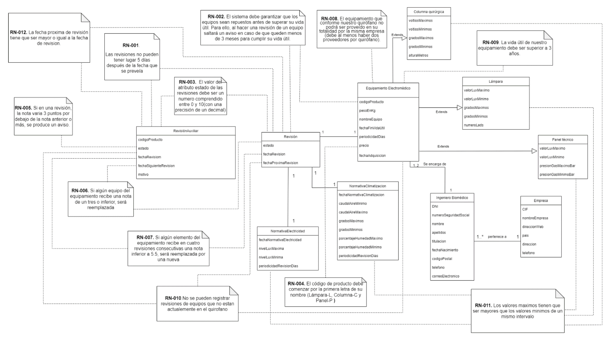
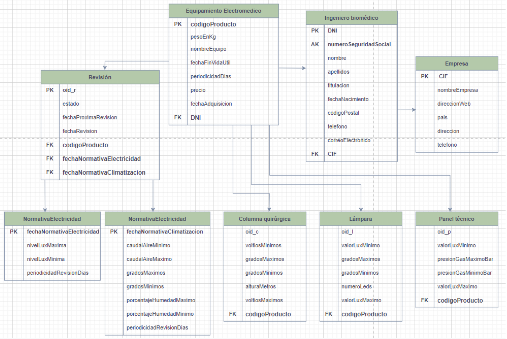

Este proyecto fue desarrollado durante la asignatura de Bases de Datos (BD) durante mi segundo año de carrera. El objetivo principal era diseñar, modelar y desarrollar una base de datos SQL para gestionar y almacenar la información de las instalaciones y equipamientos electromédicos de un quirófano. La base de datos permitiría no solo gestionar los equipos y su mantenimiento, sino también asegurar el cumplimiento de regulaciones sanitarias, controlar el valor del equipamiento, supervisar las revisiones periódicas…

## Descripción del problema
Las exigencias de cumplimiento de unos determinados estándares de calidad y asepsia en un quirófano llevan aparejado una adecuada gestión y control de todos sus elementos, de su conocimiento, mantenimiento y sustitución o reparación. Intervienen diferentes perfiles en esta función y deben poder acceder a la información de forma ordenada. Se plantea, para dar respuesta a esta situación, la creación de una base de datos para gestionar toda la información relativa a los equipos, instalaciones y equipamiento electro-médico que tiene un quirófano. El
objetivo es que los tres perfiles de acceso (el ingeniero biomédico, el director de servicios generales del hospital y el ingeniero de mantenimiento) puedan acceder y conocer todos los elementos de nuestro quirófano, así como sus atributos, la empresa a la que han sido
comprados, saber cada cuanto hay que hacer una revisión de la maquinaría o conocer los valores entre los que se debe mover nuestro equipo para que desempeñe un correcto funcionamiento (temperatura, voltaje…) entre otros.

## Solución
En el caso que estamos trabajando, se plantea crear una base de datos relacional para un quirófano estándar, es decir, una base de datos general que podrá ser aplicada a cualquier tipo de quirófano, y que si es necesario podrá ser escalable para un tipo de quirófano más complejo.

## Requisitos generales
1. Almacenar los datos personales del ingeniero biomédico encargado del mantenimiento de las máquinas de la empresa a la que pertenece.
2. Guardar toda la información del equipamiento electro-médico del que se dispone, así como información sobre las normativas de climatización y electricidad.
3. El sistema deberá ser capaz de detectar cualquier fallo en la información tanto del equipamiento electro-médico como en la electricidad y la climatización del quirófano.
4. El sistema deberá gestionar las revisiones de las instalaciones del quirófano y controlar su adecuado funcionamiento.
5. El sistema permitirá consultar la información de la base de datos y filtrarla a partir de los diferentes atributos; como por ejemplo el precio, el año de adquisición y el peso del equipamiento electro-médico, atributos personales, como nombre y apellidos y número de seguridad social.

 

## Visualizar proyecto en pdf
[Proyecto base de datos del equipamiento de un quirófano](/Proyecto-base-de-datos-QUIROFANO.pdf)